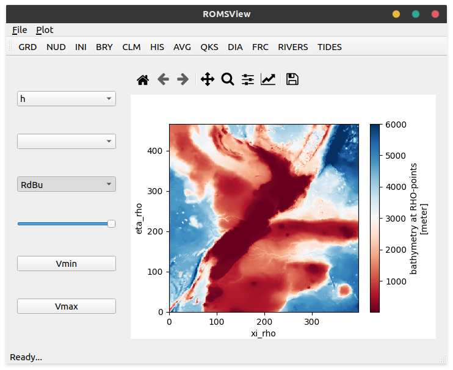

# romsview
PyQt5 Desktop GUI for visualization of ROMS input/output netcdf files

# Installation

Project is in very early development, to get the UI started:

- clone this repository
- create a python environment (python3 only)
- run the commands below in the path you cloned the repo into

```bash
pip install -r requirements.txt
python romsview.py 
```

- Click on the type of ROMS netcdf file you want to visialize on the toolbar, or simply run:

```bash
python romsview.py /path/to/roms_his.nc
```

# Examples

### Prototype screenshots



# License

Click [here](./LICENSE)

